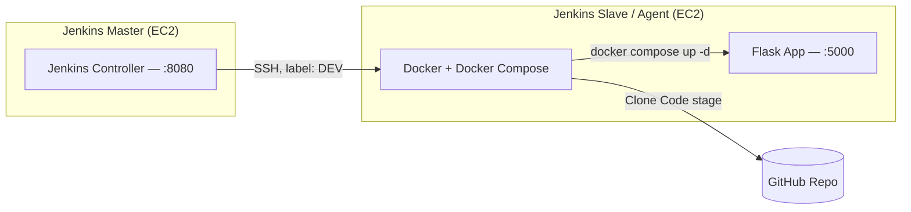

# Student-Flask-App-Pipe: Jenkins CI/CD Pipeline (Master–Agent Architecture)

## Overview

This project sets up a distributed Jenkins CI/CD pipeline across two AWS EC2 instances:

- **Jenkins Master** — runs the Jenkins controller (web UI, orchestration)
- **Jenkins Slave (Agent)** — executes the pipeline: pulls code from GitHub and deploys it with Docker Compose

The pipeline (`Student-Flask-App-Pipe`) builds, tests, and deploys a Flask application automatically whenever it's triggered.

## Architecture



| Node | Name | Role | Installed |
|------|------|------|-----------|
| Master | `Jenkins-Master` | Hosts the Jenkins controller, orchestrates builds | Java 21 (OpenJDK), Jenkins |
| Slave | `Jenkins-Slave` | Executes pipeline steps, hosts the running app | Java 21 (OpenJDK), Docker, Docker Compose |

## Prerequisites

- Two AWS EC2 instances (Ubuntu)
- A GitHub repository containing the Flask app and a `docker-compose.yml`
- Access to edit each instance's Security Group inbound rules

## Part 1 — Jenkins Master Setup

### 1.1 Launch the instance
Launch an EC2 instance, name it `Jenkins-Master`, and connect to it over SSH.

### 1.2 Install Java & Jenkins
Followed the official [Jenkins Linux install guide](https://www.jenkins.io/doc/book/installing/linux/):

```bash
sudo apt update
sudo apt install fontconfig openjdk-21-jre
java -version

sudo wget -O /etc/apt/keyrings/jenkins-keyring.asc \
  https://pkg.jenkins.io/debian-stable/jenkins.io-2026.key
echo "deb [signed-by=/etc/apt/keyrings/jenkins-keyring.asc]" \
  https://pkg.jenkins.io/debian-stable binary/ | sudo tee \
  /etc/apt/sources.list.d/jenkins.list > /dev/null
sudo apt update
sudo apt install jenkins
```

### 1.3 Manage the Jenkins service
```bash
sudo systemctl status jenkins
sudo systemctl restart jenkins   # if needed
```
(`Ctrl+C` to exit the status view.)

### 1.4 Open the Jenkins port
In the Master EC2's Security Group, add an **inbound rule** for port **8080**.

### 1.5 Access Jenkins & complete setup
1. Browse to `http://<Master-EC2-IPv4>:8080`.
2. Jenkins prompts for the initial admin password, stored on the instance at:
   ```bash
   sudo cat /var/lib/jenkins/secrets/initialAdminPassword
   ```
   Copy and paste it into the setup screen.
3. Choose **Install suggested plugins**.
4. Create the first admin user:

   | Field | Value used |
   |---|---|
   | Username | `admin` |
   | Password | *(choose your own — not shown here)* |
   | Full name | Nur Islam |
   | Email | *(your email)* |

   > Note: the password and email are left as placeholders here — swap in your own. Avoid committing real Jenkins credentials to a README or version control history.
5. **Save and Continue** → **Start using Jenkins**.

### 1.6 Create the pipeline job
1. **New Item** → name it `Student-Flask-App-Pipe` → type **Pipeline** → **OK**.
2. Description: *"This CI/CD builds, tests, and deploys."*

## Part 2 — Jenkins Slave (Agent) Setup

### 2.1 Launch the instance
Launch a second EC2 instance, name it `Jenkins-Slave`, and connect to it.

### 2.2 Install Java only
No Jenkins install is needed on the agent — just Java:
```bash
sudo apt update
sudo apt install fontconfig openjdk-21-jre
java -version
```

### 2.3 Install Docker & Docker Compose
```bash
sudo apt install docker.io
sudo apt install docker-compose-v2
sudo systemctl start docker
sudo systemctl enable docker
sudo usermod -aG docker ubuntu
cat /etc/group          # confirm ubuntu was added to the docker group
sudo reboot
```
Reconnect over SSH once the instance restarts.

## Part 3 — Connect Master & Slave via SSH

### 3.1 Generate a key pair (on Master)
```bash
ssh-keygen        # press Enter 3 times to accept the defaults
cd ~/.ssh
ls
cat id_rsa.pub    # copy the output — this is the public key
```

### 3.2 Authorize the key (on Slave)
```bash
cd ~
cd .ssh
ls
vim authorized_keys
```
Paste the copied public key on a new line — leave any existing keys as they are — then save and exit (`Esc`, `:wq`).

### 3.3 Create the deployment directory (on Slave)
```bash
cd ~
mkdir apps
cd apps
pwd               # copy this path — it becomes the Jenkins node's remote root directory
```

### 3.4 Test the connection (from Master)
```bash
ssh -i ~/.ssh/id_rsa ubuntu@<Slave-EC2-IPv4>
exit              # disconnect back to Master
```

## Part 4 — Register the Slave as a Jenkins Node

On the Jenkins Master web UI: **Manage Jenkins → Nodes → New Node**

| Field | Value |
|---|---|
| Node name | `Nur-Slave` |
| Type | Permanent Agent |
| Description | This is a node for DEV |
| Number of executors | 1 |
| Remote root directory | *(the `pwd` path copied from the Slave, e.g. `/home/ubuntu/apps`)* |
| Labels | `DEV` |
| Usage | Use this node as much as possible |
| Launch method | Launch agents via SSH |
| Host | Slave EC2's IPv4 address |
| Host Key Verification Strategy | Non verifying Verification Strategy |
| Availability | Keep this agent online as much as possible |

**Credentials** (click **+ Add** → **Jenkins**):

| Field | Value |
|---|---|
| Domain | Global |
| Kind | SSH Username with private key |
| Scope | Global (Jenkins, nodes, items, all child items, etc.) |
| ID | `Nur-Node-SSH` |
| Description | This is the key to connect NUR NODE |
| Username | `ubuntu` |
| Private Key | Master's private key (contents of `~/.ssh/id_rsa`) |

Select the newly created credential, then **Save**. After a refresh, the node should show as connected.

## Part 5 — Pipeline Script

On the `Student-Flask-App-Pipe` job → **Configure** → Pipeline script:

```groovy
pipeline {
    agent {
        node {
            label "DEV"
        }
    }
    stages {
        stage("Clone Code") {
            steps {
                git url: "repo git url", branch: "main"
                echo "Cloning code from GitHub"
            }
        }
        stage("Build & Deploy") {
            steps {
                sh "docker compose down && docker compose up -d"
                echo "App Auto Running"
            }
        }
    }
}
```
Replace `"repo git url"` with the actual GitHub repository URL, then **Save**.

## Part 6 — Run & Verify

1. Click **Build Now**.
2. Open **Console Output** to follow the build log.
3. Add an **inbound rule for port 5000** on the Slave's Security Group.
4. Visit `http://<Slave-EC2-IPv4>:5000` — the Flask app is now live, deployed automatically by the pipeline.

## Notes

- Credentials shown above (username/password/email) are placeholders — replace with your own and never commit real secrets to version control.
- Possible next steps: add a GitHub webhook to trigger builds automatically on push, add a test stage before deploy, and move to a stricter host key verification strategy once the setup is stable.
